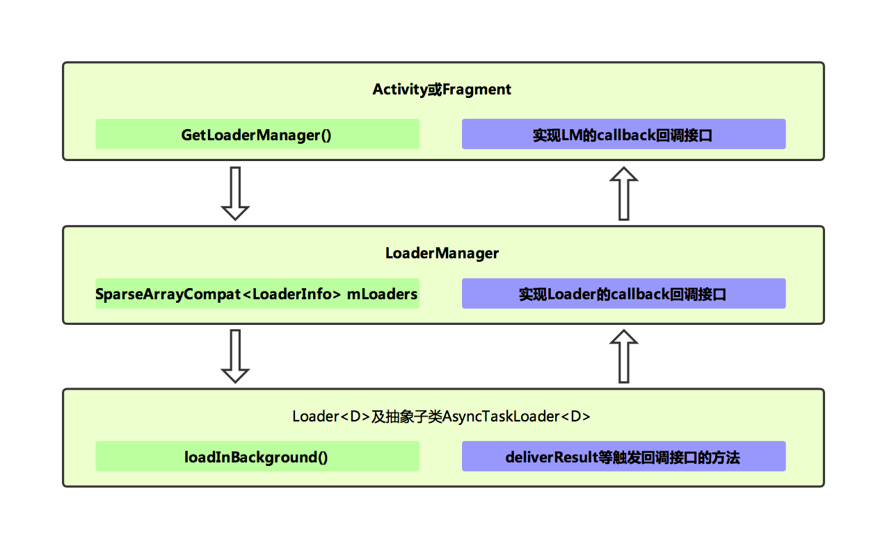

# Android 加载器

## 简介

### Loader
Android 3.0引入了加载器, 支持在Activity和Fragment中异步加载数据。加载器有以下特征：		
- 可用于每个Activity和Fragment	
- 支持异步加载数据	
- 监控数据源并在内容发生变化时传递新结果		
- 在因配置更改而重建加载器时，会自动重新连接上一个加载器的游标，因此，新加载器无需重新查询其数据	

### API 摘要
|		类/接口		|      说明       |  
|		-----   	|      -----     | 
| [LoaderManager](https://developer.android.com/reference/android/app/LoaderManager.html?hl=zh-cn)        | 与 Activity 和 Fragment 相关联的的抽象类，用于管理一个或多个 Loader 实例。在 API 层，Activity 与 Fragment 的生命周期函数中已经实现了 LoaderManager 的初始化、销毁等相关工作，因此我们无需关注生命周期的改变对数据加载的影响，因为系统为自动取消数据的加载操作。   每个 Activity 和 Fragment 中只有一个 LoaderManager，但一个 LoaderManager 可以有多个加载器。       |  
| [LoaderManager.LoaderCallbacks](https://developer.android.com/reference/android/app/LoaderManager.LoaderCallbacks.html?hl=zh-cn)        | 回调接口，用于客户端与 LoaderManager 进行交互。    例如，使用 onCreateLoader() 回调方法创建新的加载器，使用 onLoadFinished() 回调方法获取加载器加载的数据。     | 
| [Loader](https://developer.android.com/reference/android/content/Loader.html?hl=zh-cn)        | 执行异步数据加载的抽象类。     |  
| [AsyncTaskLoader](https://developer.android.com/reference/android/content/AsyncTaskLoader.html?hl=zh-cn)        | 提供 AsyncTask 来执行工作的抽象加载器。    |  
| [CursorLoader](https://developer.android.com/reference/android/content/CursorLoader.html?hl=zh-cn)        | AsyncTaskLoader 的子类，它将在后台线程查询 ContentResolver 并返回一个 Cursor 。使用此加载器是从 ContentProvider 异步加载数据的最佳方式。      |  

### 数据加载流程
如图：

